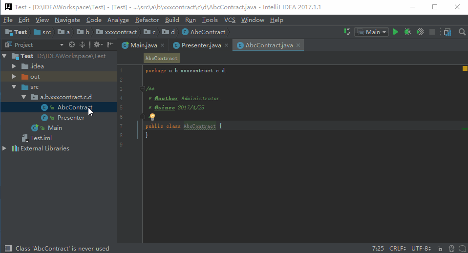
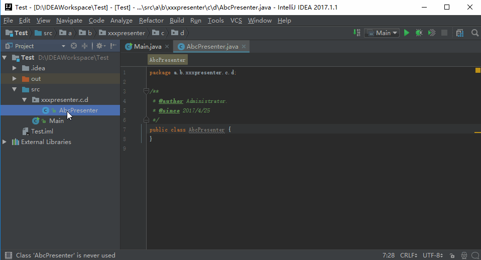
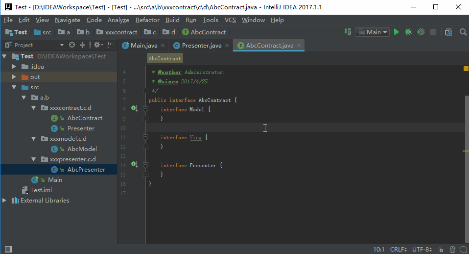
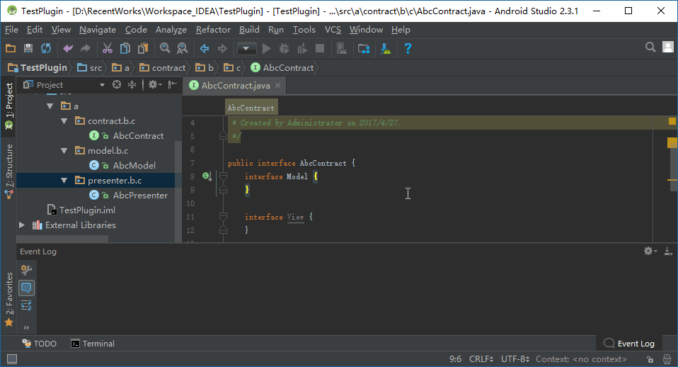
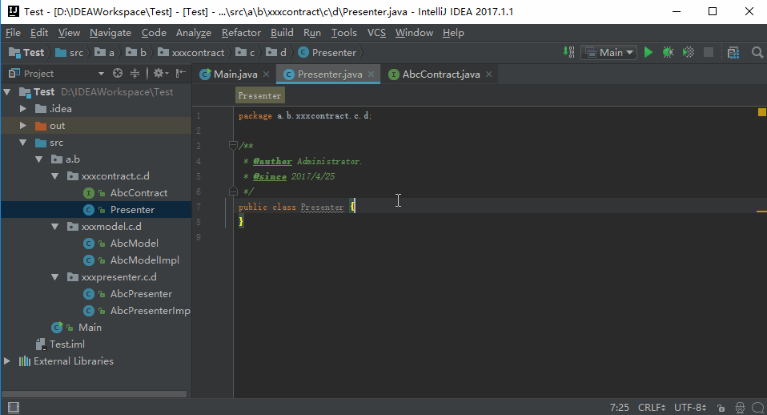
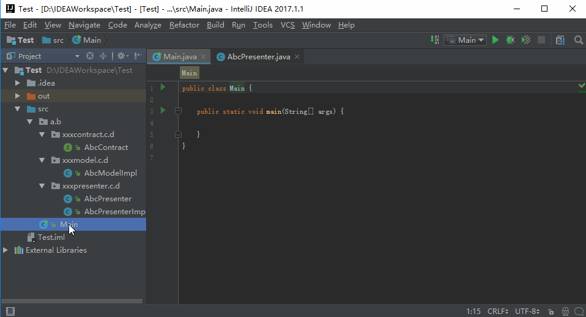

# MvpHelper [English Document](/README_EN.md)
一款适用于 ```Intellij IDEA``` 和 ```Android Studio``` 的插件, 可用于为MVP架构生成接口以及实现类, 解放双手.


欢迎 ```Issue Report```, 欢迎 ```Feature Request```, 欢迎 ```Pull Request```

感谢[XieEDeHeiShou](https://github.com/XieEDeHeiShou) 提供重构后的代码以及特性跟进。

## 预览
```Contract``` 模式：



```Presenter``` 模式(已设置后缀Impl):



后缀支持:



日志输出(气球偶尔会闪现一下,可以在Event Log里关闭):



错误提示:





## 注意
对于MVP模式，定义一个 ```Contract``` 类来放置 ```Model``` , ```View``` , ```Presenter``` 的接口，将大大减少类文件。
将普通的接口替代如下：

    public interface GoodsInfoContract {
    
        interface View {

        }
        interface Presenter {

        }
        interface Model {

        }

    }

## 如何安装
### 在插件仓库搜索MvpHelper


### 或者
#### 第一步
下载[MvpHelper_v2_2_release.jar](MVPHelper_v2_2_release.jar)
或者前往 [releases](https://github.com/XieEDeHeiShou/MVPHelper/releases/tag/2.2)

#### 第二步
安装插件


## 如何使用
在 ```Contract``` 类或者 ```Presenter``` 类内部，点击 ```Generate``` 菜单或使用快捷键 ```Alt + Insert```, 
选择 ```Mvp Helper``` 即可生成对应文件.

## 已知特性
+ 移除快捷键 ```Meta + 1```
+ 在非Java源文件中使用快捷键 ```Alt + Insert``` 时, MvpHelper菜单将不再出现
+ 不再限制根目录包名
+ 不再将 ```contract``` 包限制在根目录下, 并且支持sub-package
  例如:
  >```com.example.project.package1.contract.package2.AContract``` 
  将会生成 ```com.example.project.package1.model.package2.AModel```
  以及 ```com.example.project.package1.presenter.package2.APresenter``` 
+ 当 ```AContract``` 位于 ```presenter``` 包下时将会出现错误提示而非继续生成错误的类
+ 支持File Header Template
+ 已实现 ```Contract``` 模式
  + ```Contract``` 所处的位置中必须有至少一个包以 ```contract``` 结尾
  + 强制 ```Contract``` 为 ```interface``` 
  + ```Contract``` 中的三个接口不包含多余的修饰符
  + 重复生成将删除旧文件并重新生成
+ 已实现 ```Presenter``` 模式
  + ```Presenter``` 所处的位置中必须有至少一个包以 ```presenter``` 结尾
  + 在 ```Presenter``` 中启动插件将复刻 ```Contract``` 模式下的实现方式
  + ```Presenter``` 模式在自定义后缀的情况下不会删除原有 ```Presenter```, 因此我们建议使用```Contract``` 模式
  
## TODO
+ 实现 ```Activity``` 模式
+ 实现 ```Fragment``` 模式
+ 将生成的文件自动添加到Git (考虑到要进一步学习Git的命令行语法等相关内容, 可能会鸽)

## 参考资源
+ [Intellij Platform SDK DevGuide](http://www.jetbrains.org/intellij/sdk/docs/)
  + [Persisting State of Components](http://www.jetbrains.org/intellij/sdk/docs/basics/persisting_state_of_components.html)
   How to save and load plugin configs
+ [Customizing the IDEA Settings Dialog](https://confluence.jetbrains.com/display/IDEADEV/Customizing+the+IDEA+Settings+Dialog)
+ [IDEA Online Source Code](https://upsource.jetbrains.com/idea-ce)
  + [CreateClassAction](https://upsource.jetbrains.com/idea-ce/file/idea-ce-10df87d7a9840e5901d4901ac4fff7ba035501c2/java/java-impl/src/com/intellij/ide/actions/CreateClassAction.java)
+ [ApplicationConfigurable, ProjectConfigurable](http://corochann.com/intellij-plugin-development-introduction-applicationconfigurable-projectconfigurable-873.html)  
+ [PersistStateComponent](http://corochann.com/intellij-plugin-development-introduction-persiststatecomponent-903.html)
+ [Java Api Sample](http://www.programcreek.com/java-api-examples/index.php)
+ [Moxun's bolg](https://moxun.me/archives/category/黑科技/idea插件开发) (中文博客)
+ [AndroidStudio/IDEA插件开发学习](http://www.jianshu.com/p/0117d4b1eb00) (中文博客)

## 更新日志
### v2.x版 -基于Intellij Open Api 实现 by [XieEDeHeiShou](https://github.com/XieEDeHeiShou)
+ 2017-04-27
  + 修复实现类修饰符异常 package-private -> public
  + 新增日志类EventLogger
  + MvpHelper_v2_2_release.jar
+ 2017-04-25
  + 实现配置信息的存取
  + 实现运行时加载配置信息
  + MvpHelper_v2_0_release.jar
  + 追加 用户指导.gif
  + 向[原仓库](https://github.com/githubwing/MVPHelper)请求合并
  + 在Android Studio 环境下测试Java项目与Android项目
  + 修复Merge后造成的 ```Contract``` 修饰符异常,强制生成后的 ```Contract``` 为 ```public interface PrefixContract```
  + 修复配置面板在销毁时触发的 ```AbstractMethodException```
  + MvpHelper_v2_1_release.jar
+ 2017-04-24
  + 实现配置面板布局
  + 实现 ```Presenter``` 模式下的包生成类 ```PresenterModeDirGenerator```
  + 抽取各功能实现类接口,重新分包
  + 基于Intellij Open Api 更新 ```Contract``` 而非以替换文本的方式更新
    + 强制 ```Contract``` 为 ```interface```
    + 移除 ```Contract``` 中接口的多余修饰符 ```public```
+ 2017-04-23 
  + 实现在指定包下生成类文件, 并注入包信息
  + 实现让生成类实现特定接口
  + 更新README.CN.MD
+ 2017-04-15 更新对当前环境的判定规则
+ 2017-04-12 实现Action的可见性判定, 当用户尝试通过 ```Alt + Insert``` 启动插件时, 
             将判断当前环境是否为Java源文件环境, 当条件不成立时将不再显示插件动作
+ 2017-04-11 实现 ```DirGenerator``` 与 ```FileGenerator``` 用于分别生成 ```package``` 与 ```class```
+ 2017-04-10 实现 ```EnvironmentChecker``` 用于检查当前环境是否满足生成条件:
  + Java源文件的文件名是否以 ```Contract``` 结尾, 并处于 ```contract``` 包下
  + Java源文件的文件名是否以 ```Presenter``` 结尾, 并处于 ```presenter``` 包下


### v1.x版 -基于Java IO Api 实现 by [githubwing](https://github.com/githubwing)
+ 2017-04-10 将源文件分包并尝试重构
+ 2017-04-09 移除源文件中的 ```C``` 语言异味
+ 2017-04-06 分支自[原仓库](https://github.com/githubwing/MVPHelper), 并向源文件中追加注释, 以便阅读
  
## Eclipse


# License

    Copyright 2016 androidwing1992

    Licensed under the Apache License, Version 2.0 (the "License");
    you may not use this file except in compliance with the License.
    You may obtain a copy of the License at
    
        http://www.apache.org/licenses/LICENSE-2.0
    
    Unless required by applicable law or agreed to in writing, software
    distributed under the License is distributed on an "AS IS" BASIS,
    WITHOUT WARRANTIES OR CONDITIONS OF ANY KIND, either express or implied.
    See the License for the specific language governing permissions and
    limitations under the License.
